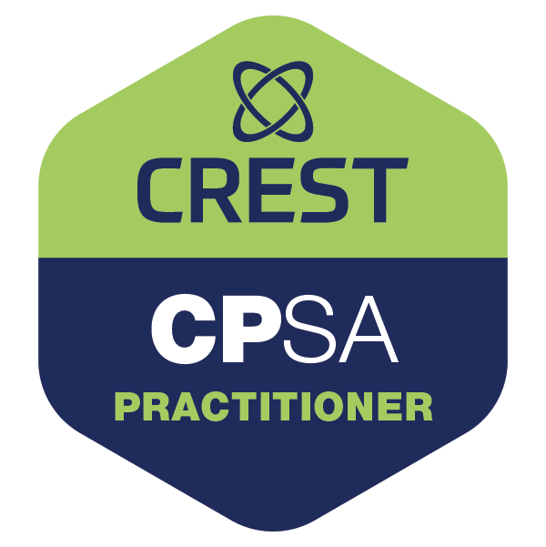

# CPSA Tests

<p align="center">
  <strong>Offline CREST CPSA practice quiz with 3,000+ questions, Android support, and detailed score tracking.</strong>
</p>

<p align="center">
  
</p>

<p align="center">
  <a href="./CPSA-Tests.apk"><strong>Download Android APK</strong></a>
  ·
  <a href="./index.html"><strong>Open HTML Version</strong></a>
</p>

<p align="center">
  
  
  
  
</p>

---

## Overview

**CPSA Tests** is an offline practice quiz app designed to help candidates prepare for the **CREST Practitioner Security Analyst (CPSA)** exam.

It includes **over 3,000 practice questions** covering a wide range of CPSA-relevant topics, making it useful for repeated revision, fast knowledge checks, and mobile study sessions.

The app is available in two formats:

- A ready-to-install **Android APK**
- A standalone **HTML version** that runs directly in the browser

No login, no server, no subscription, and no Internet connection required.

---

## Question Bank

The question set contains **3,000+ CPSA-style practice questions**.

The questions have been built from a combination of:

- Publicly available study references
- Public cybersecurity learning material
- CPSA-relevant technical knowledge areas
- Custom questions created by the author

This project is intended for learning, self-assessment, and exam preparation.

---

## Key Features

- **3,000+ practice questions**
- **Android APK included**
- **Standalone browser version included**
- **No account required**
- **Mobile-friendly quiz interface**
- **Randomized question order**
- **Instant answer feedback**
- **Incorrect answer tracking**
- **Final quiz summary**
- **Elapsed time tracking**
- **Accuracy percentage**
- **Attempted question count**
- **Skipped question count**
- **Restart quiz option**

---

## Score Tracking

At the end of a quiz session, CPSA Tests shows a clear performance summary, including:

| Metric | Description |
|---|---|
| Correct | Number of questions answered correctly |
| Incorrect | Number of questions answered incorrectly |
| Accuracy | Percentage score based on attempted questions |
| Attempted | Total number of questions answered |
| Skipped | Questions not answered before finishing |
| Total | Total number of available questions |
| Time | Total elapsed quiz time |

This makes it easy to track progress across repeated study sessions.

---

## Downloads

### Android APK

Download:

```text
CPSA-Tests.apk
```

Install it on your Android device and launch **CPSA Tests**.

Depending on your Android settings, you may need to allow installation from unknown sources.

### Browser Version

Open:

```text
index.html
```

The HTML version runs directly in any modern browser.

No local server is required.

---

## Repository Contents

```text
.
├── README.md
├── CPSA-Tests.apk
└── index.html
```

| File | Description |
|---|---|
| `README.md` | Project documentation |
| `CPSA-Tests.apk` | Ready-to-install Android application |
| `index.html` | Standalone HTML quiz version |

---

## Disclaimer

This project is independent study material for CPSA preparation.

It is not affiliated with, endorsed by, sponsored by, or officially connected to CREST.

CREST and CPSA are trademarks or registered marks of their respective owners.

The questions are intended for educational practice and revision only.

---

## License

No license has been selected yet.

Unless a license is added, all rights are reserved by the repository owner.
